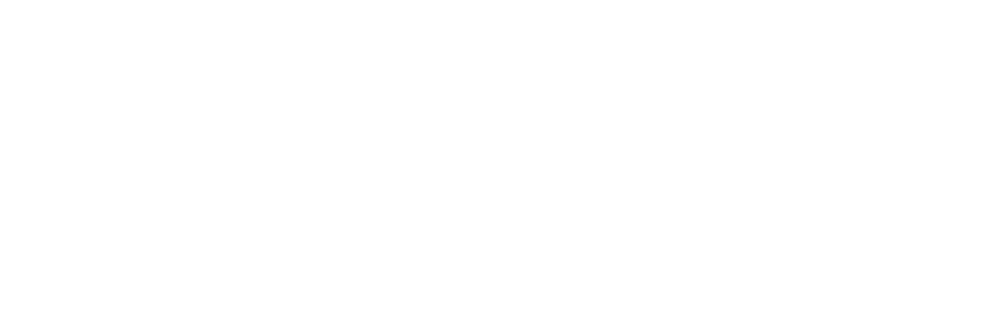

# Macros - Social Nutrition Tracker

<div align="center">
  
</div>

## Overview
Macros is a social nutrition tracking platform that helps users monitor their macronutrient intake and share their fitness journey with others. Built with modern web technologies and a focus on user experience, Macros makes it easy to track your nutrition while connecting with a community of like-minded individuals.

## ✨ Features

### 🍎 Nutrition Tracking
- **USDA Food Database**: Search and add foods from the comprehensive USDA database
- **Meal Categories**: Organize foods into breakfast, lunch, dinner, snacks, and water intake
- **Custom Food Entries**: Add your own foods with detailed nutritional information
- **Photo Sharing**: Upload pictures of your meals (coming soon)
- **Quick Add**: Save and reuse frequently eaten meals

### 👥 Social Features
- **User Following**: Connect with other users and follow their nutrition journey
- **User Search**: Find and connect with other users easily
- **Profile Management**: Customize your profile with pictures and bio
- **Social Feed**: View and interact with your network's food entries (in development)
- **Comments & Likes**: Engage with your network's posts (coming soon)

### 📱 User Experience
- **Modern UI**: Beautiful and responsive interface built with shadcn/ui
- **Dark/Light Mode**: Choose your preferred theme
- **Mobile Responsive**: Optimized for all screen sizes
- **Real-time Updates**: Instant updates for social interactions
- **Intuitive Navigation**: Easy-to-use sidebar navigation

## 🛠️ Tech Stack

### Frontend
- **Next.js 14**: React framework with server-side rendering
- **TypeScript**: Type-safe development
- **shadcn/ui**: Beautiful and accessible UI components
- **Tailwind CSS**: Utility-first styling
- **Lucide Icons**: Modern icon set
- **React Query**: Data fetching and caching (coming soon)

### Backend
- **Node.js**: Runtime environment
- **Express.js**: Web framework
- **MongoDB**: NoSQL database
- **JWT**: Secure authentication
- **Cloudinary**: Image storage (coming soon)

### External APIs
- **USDA API**: Comprehensive food database
- **Cloudinary API**: Image management (coming soon)
- **SendGrid**: Email verification (planned)

## 🚀 Getting Started

1. Clone the repository
```bash
git clone https://github.com/your-username/macros.git
cd macros
```

2. Install dependencies
```bash
# Backend
cd server
npm install

# Frontend
cd client
npm install
```

3. Set up environment variables
Create `.env` files in both `server` and `client` directories:

### Backend (.env)
```env
PORT=5000
MONGODB_URI=your_mongodb_connection_string
ACCESS_TOKEN_SECRET=your_jwt_secret
USDA_API_KEY=your_usda_api_key
# Coming soon:
# CLOUDINARY_CLOUD_NAME=your_cloudinary_cloud_name
# CLOUDINARY_API_KEY=your_cloudinary_api_key
# CLOUDINARY_API_SECRET=your_cloudinary_api_secret
# SENDGRID_API_KEY=your_sendgrid_key
```

4. Start the development servers
```bash
# Backend
cd server
npm start

# Frontend
cd client
npm run dev
```

## 📱 Mobile App (Coming Soon)
- Flutter implementation in development
- Cross-platform support
- Native-like experience
- Shared features with web version

## 🧪 Testing

Currently implementing comprehensive testing:
- Unit tests for components and utilities
- Integration tests for API endpoints
- End-to-end testing for critical user flows
- Continuous Integration with GitHub Actions

## 📖 Development Guidelines

### Component Architecture
- Small, focused components
- Feature-based organization
- Reusable UI components
- Clear separation of concerns

### Best Practices
- TypeScript for type safety
- Component composition
- Custom hooks for logic reuse
- Consistent naming conventions
- Comprehensive error handling
- Responsive design patterns

## 🤝 Contributing

We welcome contributions! Please check our contributing guidelines for details on how to help improve Macros.