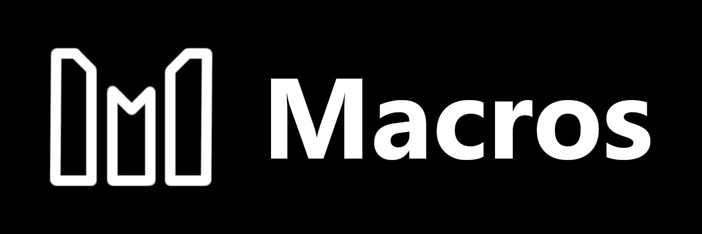

# Macros - Social Nutrition Tracker

<div align="center">
  
</div>

## Overview
Macros is a social nutrition tracking platform that helps users monitor their macronutrient intake and share their fitness journey with others. Users can log foods, track nutritional data, follow other users, and share photos of their meals in a supportive community environment.

## Development Guidelines

### Component Architecture
- Prefer small, focused components over large, multi-purpose ones
- Create new components when a piece of UI:
  - Is reused in multiple places
  - Contains more than 100 lines of code
  - Handles a distinct piece of functionality
  - Has its own state management needs

### UI Components
- Use shadcn/ui components as the foundation for all UI elements
- Preferred component order:
  1. shadcn/ui components
  2. Custom components built on shadcn/ui
  3. Vanilla Tailwind components only when necessary

### Component Organization
```
components/
  ui/             # shadcn/ui components
  features/       # feature-specific components
    nutrition/    # nutrition tracking related
    social/       # social features related
  layout/        # layout components
  shared/        # shared/common components
```

## Features

- **User Authentication**: Secure login/signup system with email verification
- **Macro Tracking**: Log foods and track your daily macro intake
- **Social Feed**: Share your meals and progress with the community
- **Photo Sharing**: Upload food photos and share your healthy meals
- **Progress Visualization**: Track your nutrition journey with beautiful charts
- **Mobile Apps**: Coming soon for iOS and Android (Flutter & React Native)

## Tech Stack

### Frontend
- **Next.js 14**: React framework for the web application
- **TypeScript**: Type-safe code
- **shadcn/ui**: Beautiful and customizable UI components
- **Tailwind CSS**: Utility-first CSS framework
- **Lucide Icons**: Modern icon set

### Backend
- **Node.js**: Runtime environment
- **Express.js**: Web framework
- **MongoDB**: Database
- **JWT**: Authentication

### APIs & Services
- **SendGrid**: Email verification (coming soon)
- **Cloudinary**: Image storage and optimization
- **USDA API**: Nutritional information database
- **MongoDB Atlas**: Cloud database hosting

## Environment Variables

### Backend (.env)
```env
PORT=5000
MONGODB_URI=your_mongodb_connection_string
JWT_SECRET=your_jwt_secret
SENDGRID_API_KEY=your_sendgrid_key
CLOUDINARY_CLOUD_NAME=your_cloudinary_cloud_name
CLOUDINARY_API_KEY=your_cloudinary_api_key
CLOUDINARY_API_SECRET=your_cloudinary_api_secret
USDA_API_KEY=your_usda_api_key
```

## Getting Started

1. Clone the repository
```bash
git clone https://github.com/your-username/macros.git
cd macros
```

2. Install dependencies
```bash
# Backend
cd server
npm install
npm install postman

# Frontend
cd client
npm install
```

3. Set up environment variables
- Create `.env` files in both `server` and `client` directories using the templates above

4. Start the development servers
```bash
# Backend
cd server
npm start

# Frontend
cd client
npm run dev
```

## Mobile Apps (Coming Soon)
- Flutter app

## AI Rules

When implementing or modifying UI features:

1. COMPONENT CREATION THRESHOLD
- Create a new component when code exceeds 100 lines
- Create a new component when functionality is distinct
- Create a new component for reusable UI patterns
- Break down complex components into smaller, focused ones

2. SHADCN/UI PRIORITY
- Always check shadcn/ui first for needed components
- Use shadcn/ui components as building blocks
- Extend shadcn/ui components rather than creating from scratch
- Only use vanilla Tailwind when shadcn/ui doesn't provide a solution

3. COMPONENT ORGANIZATION
Place new components in:
- /components/features/{feature-name}/ for feature-specific components
- /components/shared/ for reusable components
- /components/layout/ for layout-related components
- Keep shadcn/ui components in /components/ui/

4. COMPOSITION OVER COMPLEXITY
- Prefer composing multiple small components over single large ones
- Use composition patterns like render props or component slots
- Keep component logic focused and single-purpose
- Extract shared logic into custom hooks

5. NAMING CONVENTIONS
- Use clear, descriptive names that indicate purpose
- Suffix with type (e.g., Card, List, Form)
- Prefix with feature name for feature-specific components
- Use consistent naming across related components